# CarlinKit CPC200-CCPA — VID/PID Mod via CH341A (Ubuntu WSL)

Read the dongle's flash chip with a CH341A, change the USB VID & PID inside the firmware, and write it back. Every command is ready to copy and paste. The VID, PID and WSL username in them are examples — put your own in as you go.

**Brand:** Proton · **Dongle:** CPC200-CCPA · **Chip:** MX25L12835F · **Method:** JFFS2 · **Hardware:** CH341A + SOIC clip

---

## Contents

- [Step 0 — Overview](#step-0--overview)
- [Step 1 — Prerequisites](#step-1--prerequisites)
- [Step 2 — Settings & WSL Tools](#step-2--settings--wsl-tools)
- [Step 3 — Jefferson Setup](#step-3--jefferson-setup)
- [Step 4 — Dump the Firmware](#step-4--dump-the-firmware)
- [Step 5 — Unpack the RootFS](#step-5--unpack-the-rootfs)
- [Step 6 — Edit VID/PID](#step-6--edit-vidpid)
- [Step 7 — Repack & Put Back](#step-7--repack--put-back)
- [Step 8 — Flash With NeoProgrammer](#step-8--flash-with-neoprogrammer)
- [Step 9 — Test in the Car](#step-9--test-in-the-car)
- [Next Dongle](#next-dongle)
- [Fix Fast](#fix-fast)
- [Project Notes](#project-notes)

---

## Step 0 — Overview

`Read First`

This guide changes the USB Vendor ID (VID) and Product ID (PID) of a CarlinKit CPC200-CCPA dongle. You read the whole flash chip with a CH341A, unpack the JFFS2 filesystem in WSL, edit three small files, pack it back up, and write it back to the chip.

**The full flow:**

**Reference** — From a stock dongle to a modded one
```text
Phase 1  Read the chip    → CH341A + NeoProgrammer: read twice, keep a backup
Phase 2  Unpack & edit    → WSL: dd → Jefferson → edit 3 files in VS Code
Phase 3  Repack & flash   → WSL: mkfs.jffs2 → dd back → NeoProgrammer write
```

> [!TIP]
> **Only 3 files change:**
>
> - `etc/riddle.conf` — the dongle's saved settings. This is the one that really counts.
> - `etc/riddle_default.conf` — the default settings. The dongle goes back to these after a reset.
> - `script/start_accessory.sh` — a backup value, only used if the settings are ever empty.
>
> Everything else in the firmware stays exactly as it was.

### Read these labels first

Every command box has a bold label just above it. The label tells you **where to run it**, or that you should not run it at all.

| Label | What it means |
|---|---|
| **WSL** | Run in **Ubuntu** |
| **Windows** | Run in **PowerShell** or paste into **Explorer** |
| **NeoProgrammer** | Do it by hand in **NeoProgrammer** |
| **Output** | **Don't run.** This shows what you should see |
| **Reference** | **Don't run.** Shown only to explain things |

> [!CAUTION]
> **Safety rules. Read these once:**
>
> - **Pin 1 must line up.** The red wire of the SOIC clip goes on pin 1 of the chip (the side with the small dot). The wrong way round can damage the chip.
> - **Never edit a corrupted dump.** If the read gives errors, or two reads don't match, stop and read again.
> - **Always keep a backup of the original dump**, separate from the copy you work on.
> - **Never erase the chip** unless you have good, checked firmware ready to write.
> - **Don't take the clip off in the middle of a write.**
>
> Changing only the VID/PID will **not** brick the dongle, as long as the dump is clean and you follow every step.

## Step 1 — Prerequisites

`Hardware + Software`

### 1.1 — Hardware

| Item | Notes |
|---|---|
| CarlinKit `CPC200-CCPA` | The dongle you are modding. You need to open the case to reach the flash chip. |
| CH341A programmer | The common black or green USB board. It reads and writes the chip. |
| 8-pin SOIC clip | Clips onto the chip so you don't have to desolder it. The red wire marks pin 1. |
| Windows 10/11 PC | Runs NeoProgrammer and Ubuntu on WSL. |

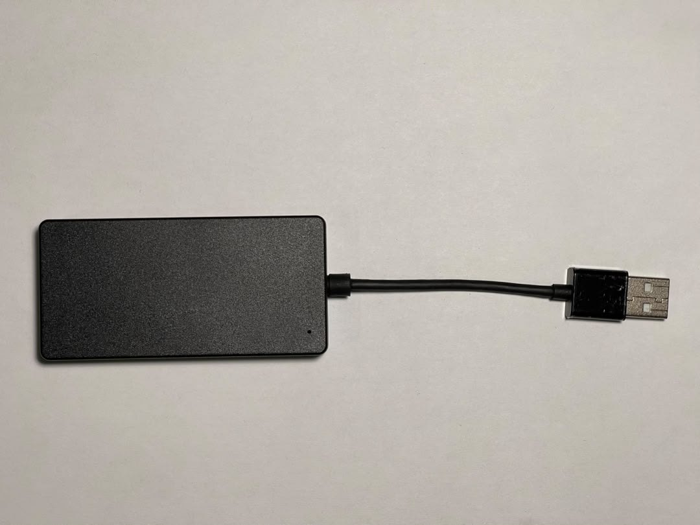

*The CarlinKit CPC200-CCPA as it comes. The case clips shut, there are no screws.*

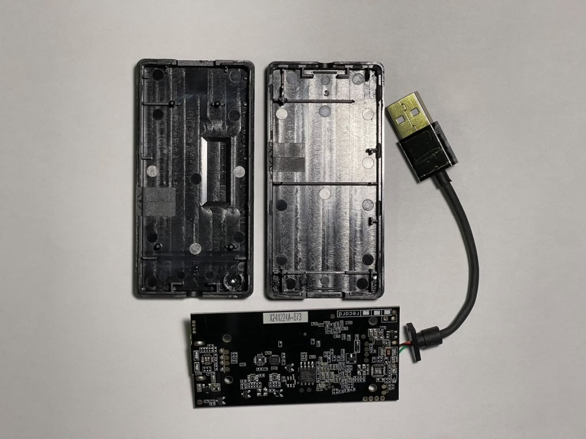

*Opened up. The case is two halves and the board lifts straight out.*

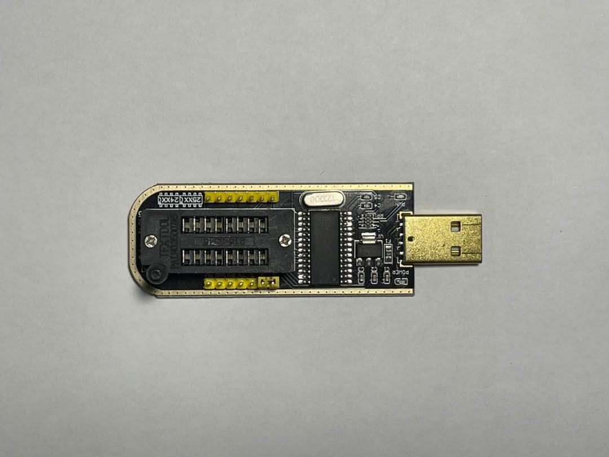

*CH341A programmer. The black ZIF socket takes the clip adapter, and the yellow jumper must sit on `25XX`.*

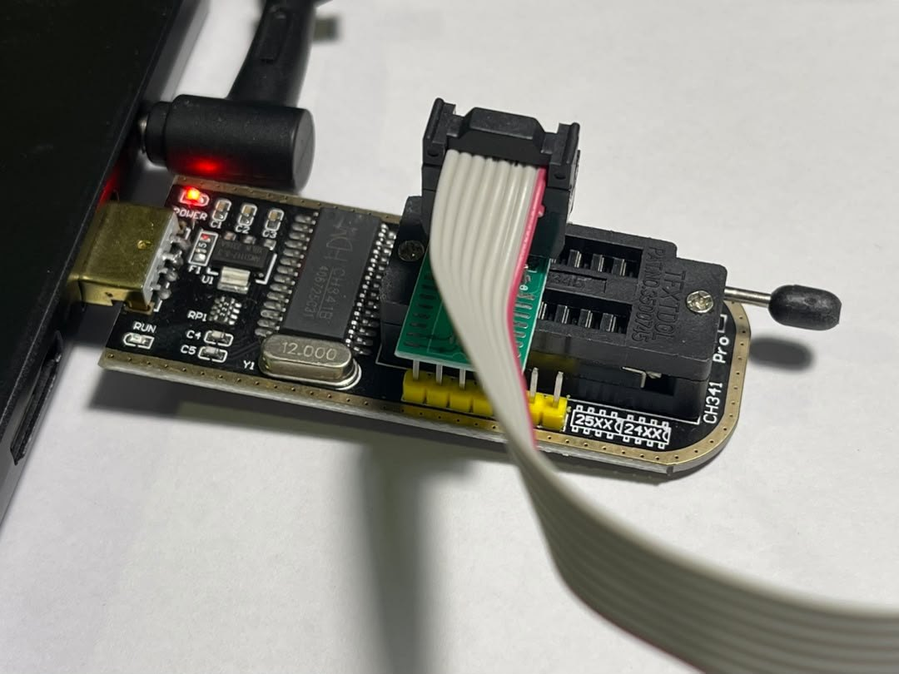

*Plugged in and powered. Check the **yellow jumper** sits across the `25XX` pins — on `24XX` the chip will never be found.*

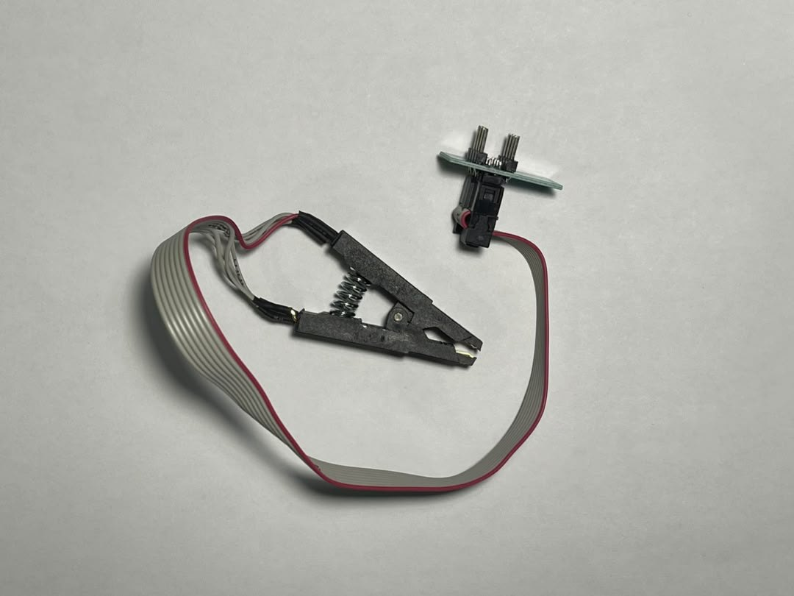

*The 8-pin SOIC clip and its adapter board. The **red wire** marks pin 1, and that decides which way round the clip goes.*

### 1.2 — The flash chip

| Spec | Value |
|---|---|
| Chip | Macronix `MX25L12835F` |
| Series | `25L128` |
| Package | 8-pin SOIC |
| Size | 16 MB (16,777,216 bytes) |

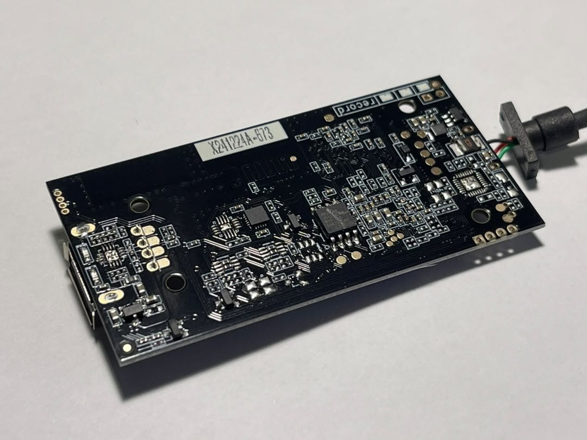

*The side of the board the flash chip sits on. Everything happens on this side.*

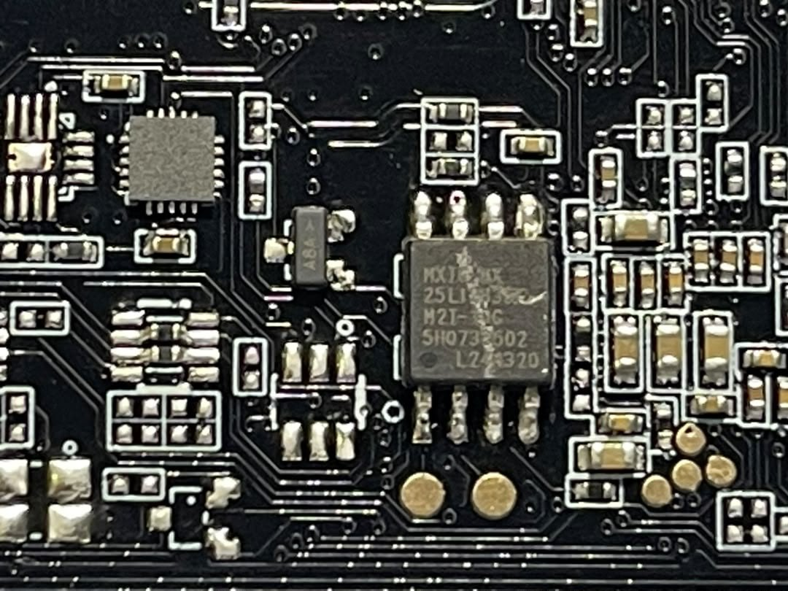

*The chip itself, marked `MX25L 12835F`. Read this marking before you start. A different chip means a different guide.*

### 1.3 — Software & drivers

| Software | Used for |
|---|---|
| CH341A driver | So Windows can talk to the programmer. From the chip maker, WCH: [CH341PAR driver](https://www.wch-ic.com/downloads/CH341PAR_EXE.html). Take the **PAR** driver, not SER. The CH341A uses its parallel/SPI mode to read chips. |
| NeoProgrammer | Reads and writes the chip. There is no official home page. This guide uses [NeoProgrammer V2.2.0.10-Upgrade 30_12_2023.rar](https://github.com/GioLangLe/CH341B-NeoProgramer/blob/main/NeoProgrammer%20V2.2.0.10-Upgrade%2030_12_2023.rar) from GitHub. On that page, click the download button (↓) at the top right, then unpack it with 7-Zip or WinRAR. It's a copy uploaded by a third party, so scan it with [VirusTotal](https://www.virustotal.com/) before you run it. |
| Ubuntu on WSL | Unpacks and repacks the firmware. [Microsoft's install guide](https://learn.microsoft.com/en-us/windows/wsl/install). Steps are in 1.4 below. |
| Visual Studio Code | To edit the three files. [code.visualstudio.com](https://code.visualstudio.com/), or search for it in the Microsoft Store. |
| VS Code WSL extension | Lets VS Code open folders inside WSL. [WSL extension](https://marketplace.visualstudio.com/items?itemName=ms-vscode-remote.remote-wsl). |
| Jefferson (CarlinKit version) | Unpacks the JFFS2 filesystem. You install it in [Step 3](#step-3--jefferson-setup), using [onekey-sec/jefferson](https://github.com/onekey-sec/jefferson) and [ludwig-v/jefferson_carlinkit](https://github.com/ludwig-v/jefferson_carlinkit). |

**1.4 — Install Ubuntu on WSL** (skip this if you already have it)

Get it from the **Microsoft Store** (search for `Ubuntu`). Or open PowerShell (press `Win + R`, type `powershell`, press Enter) and run:

**Windows** — Install Ubuntu on WSL
```bat
wsl --install -d Ubuntu
```

> [!NOTE]
> Restart the PC if it asks you to. The first time you open Ubuntu, it asks you to make a username and password. Just do it.

### 1.5 — Set up VS Code for WSL

Install VS Code, open it, and add the **WSL** extension: press `Ctrl + Shift + X`, search for `WSL`, and click Install.

## Step 2 — Settings & WSL Tools

`WSL Ubuntu`

### 2.1 — Find your WSL username

Run this in Ubuntu. The answer goes into the Windows Explorer paths in Step 4 and Step 7.

**WSL** — Check WSL username
```bash
whoami
```

### 2.2 — Fill in your settings

The commands below use `369D` as the VID and `38B` as the PID. Those are the values for a Proton head unit — if your target is something else, use your own. `YOUR_WSL_USER` is your WSL username.

> [!WARNING]
> **Number format: plain hex. Never add `0x`.** Write `369D`, not `0x369D`. With `0x` in front, the driver reads it as `0x36`, which is wrong. Why is in [Project Notes](#project-notes), note 2.

### 2.3 — Install the WSL tools

**WSL** — Update package list
```bash
sudo apt update
```

**WSL** — Install required packages
```bash
sudo apt install -y binwalk python3 pipx mtd-utils
```

**WSL** — Add pipx to PATH
```bash
pipx ensurepath
```

> [!WARNING]
> **Reload your terminal after this.**`pipx ensurepath` updates your PATH, but the change doesn't reach the window you already have open. Run the command below, or close and reopen Ubuntu.

**WSL** — Apply PATH changes without restarting
```bash
source ~/.bashrc
```

**WSL** — Install poetry via pipx
```bash
pipx install poetry
```

## Step 3 — Jefferson Setup

`WSL Ubuntu`

Jefferson is the tool that unpacks the JFFS2 filesystem from the firmware. The normal version can't read CarlinKit firmware properly, so you swap its code for a version made for CarlinKit. **You only do this once.**

### 3.1 — Download & install Jefferson

**WSL** — Go to WSL home folder
```bash
cd ~
```

> [!NOTE]
> Do the clone from your home folder (`~`). Later steps expect the folder at `~/jefferson`. If you clone it somewhere else, those commands will fail.

**WSL** — Clone Jefferson repository
```bash
git clone https://github.com/onekey-sec/jefferson.git
```

**WSL** — Enter jefferson folder and install
```bash
cd jefferson
poetry install
```

### 3.2 — Swap in the CarlinKit version

This one command downloads the CarlinKit version into a temporary folder, copies only the inner `jefferson` folder into place, then deletes the temporary folder.

**WSL** — Remove standard module, clone fork, swap in
```bash
rm -rf ~/jefferson/jefferson && git clone https://github.com/ludwig-v/jefferson_carlinkit /tmp/jck && cp -r /tmp/jck/jefferson ~/jefferson/jefferson && rm -rf /tmp/jck
```

### 3.3 — Add the extra packages it needs

Run this inside the `~/jefferson` folder (you are already there after 3.1).

**WSL** — Install missing dependencies
```bash
poetry add click cstruct
```

> [!WARNING]
> **Why you need these:** the CarlinKit version uses `click` and `cstruct`, but the original jefferson `pyproject.toml` doesn't list them. Swapping in the new code doesn't install them for you. If you only added `click` before and still get an error, run `poetry add cstruct` in `~/jefferson`.

**WSL** — Back to WSL home
```bash
cd ~
```

## Step 4 — Dump the Firmware

`CH341A · NeoProgrammer`

### 4.1 — Attach the SOIC clip

1. Unplug the dongle from everything. Open the case.
2. Put the 8-pin SOIC clip on the **Macronix chip**.
3. **Line up pin 1.** The red wire on the clip goes on **pin 1** of the chip. Pin 1 has a small dot next to it on the chip.
4. Only when the clip is firmly on, plug the **CH341A into the PC**.

> [!CAUTION]
> **Getting pin 1 right is very important.** If the clip is the wrong way round, it can damage the chip or give you a broken read.

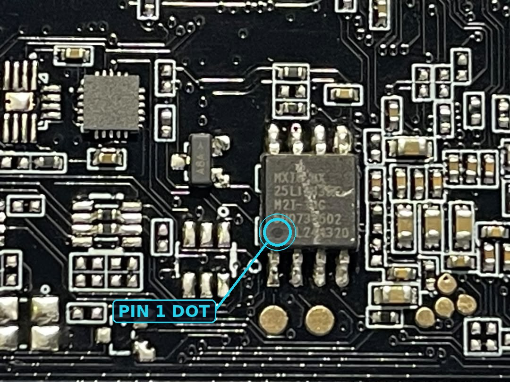

_**Find pin 1 first.** The small dot pressed into the corner of the chip is pin 1 — circled here. The **red wire** on the clip goes on that corner. Check this before the clip goes anywhere near the board._

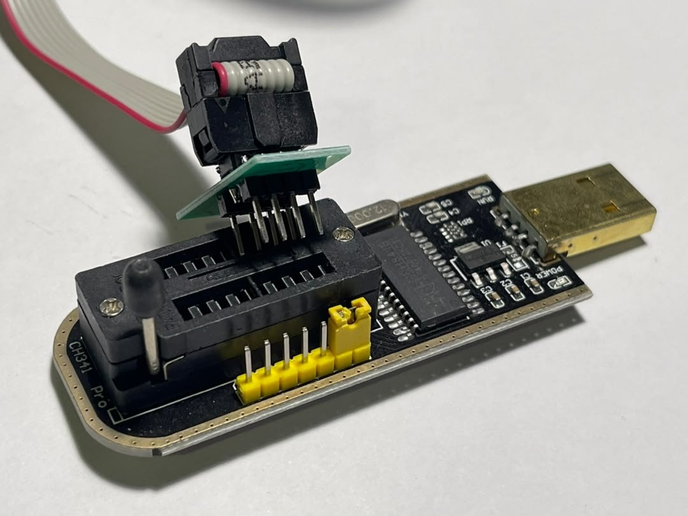

*The adapter board goes in pins-down, at the **lever end** of the socket. Close the lever before you plug the clip cable on.*

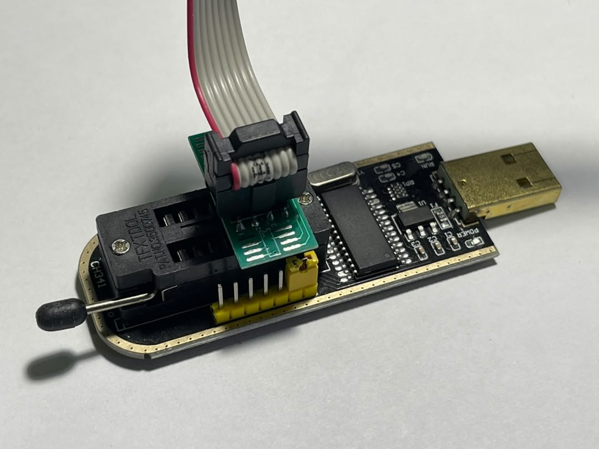

*The ribbon connector pushed fully home on the adapter. The **red stripe** on the ribbon stays on the same side as pin 1.*

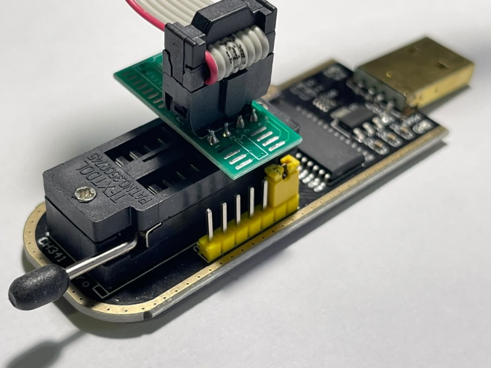

*Adapter board in the CH341A socket, lever pushed down. Pin 1 of the socket is the end nearest the lever.*

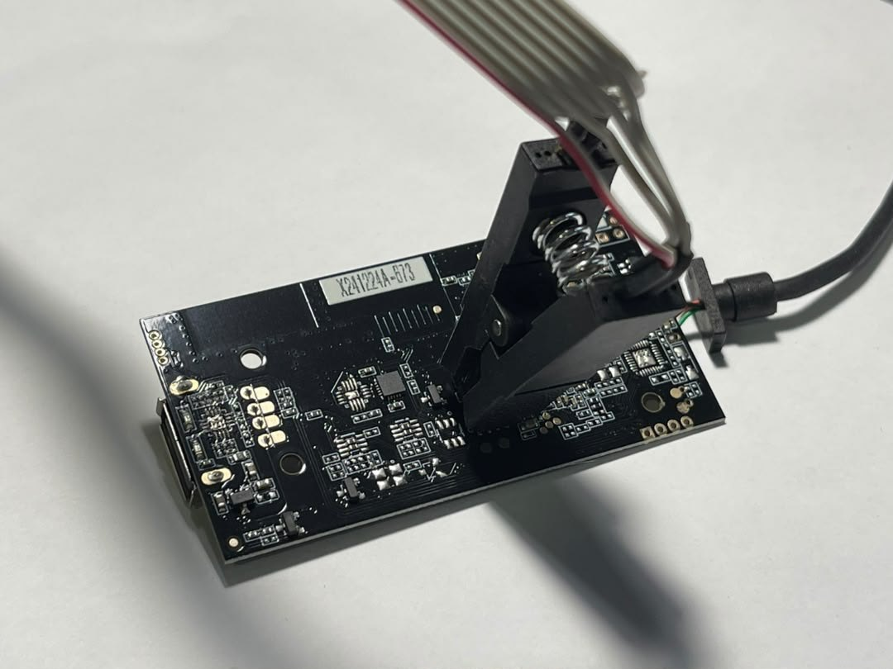

*The clip sitting square on the chip. All eight jaws must touch, and the **red wire** must be on the pin-1 side.*

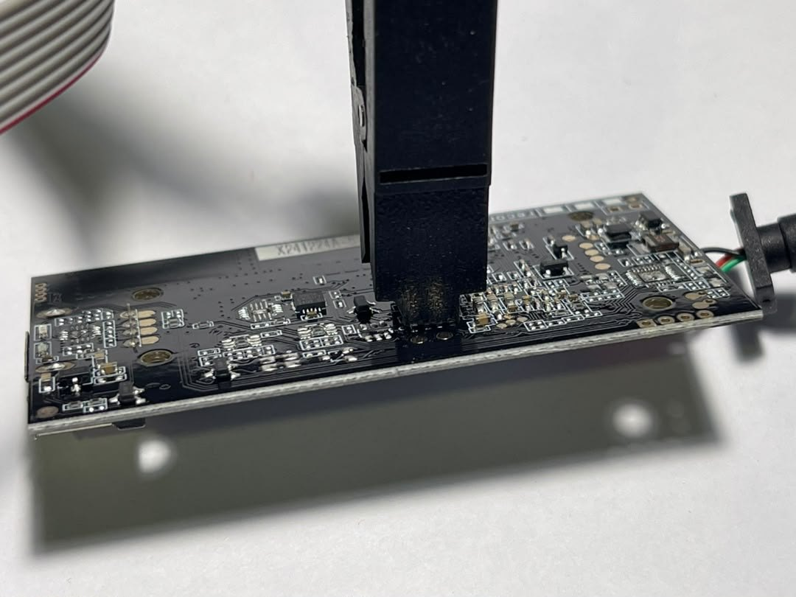

*Press the clip straight down, square on the chip. If it leans, only some jaws touch and the read comes back wrong.*

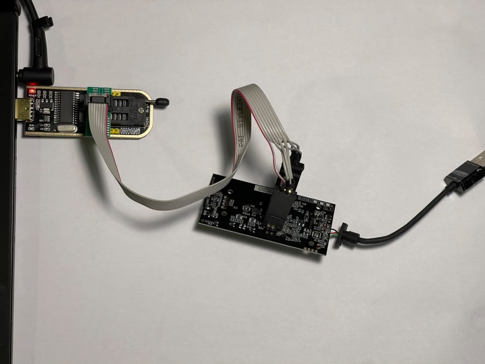

*The whole rig. The dongle's own USB cable stays unplugged while you read and write the chip.*

### 4.2 — Read the chip twice

1. Open **NeoProgrammer**.
2. Click **Detect**. A **Search IC** window opens — pick `MX25L12835F` from the list and click **Select**.
3. Click **Read**. Save the result as `dump.bin`.
4. Click **Read** again. Save this one as `dump2.bin`.
5. **Make a backup copy of `dump.bin` right away**, in a separate folder. Never touch it.

> [!NOTE]
> Why read twice? A loose clip can give a read that looks fine but has wrong bytes in it. If two reads match, the read is good.

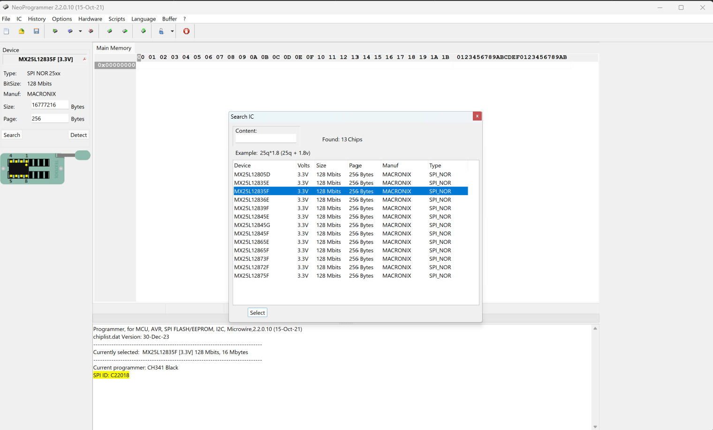

_**Detect** opens this window. Pick `MX25L12835F` — 3.3V, 128 Mbits, MACRONIX — and click **Select**. The log line `SPI ID: C22018` is the chip answering, so the clip is on properly._

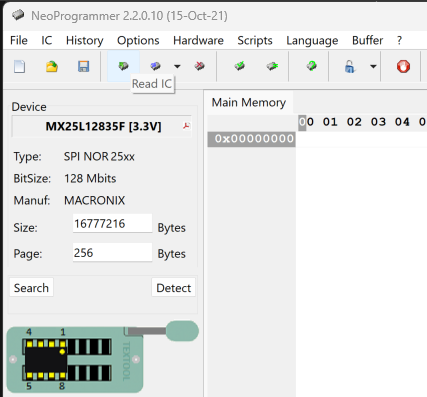

_**Read IC** — the second green button. This reads all 16 MB off the chip into the buffer._

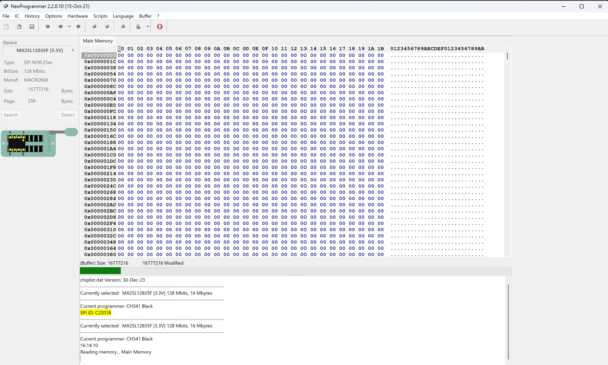

*A read in progress. It takes a couple of minutes, and the buffer fills as it goes.*

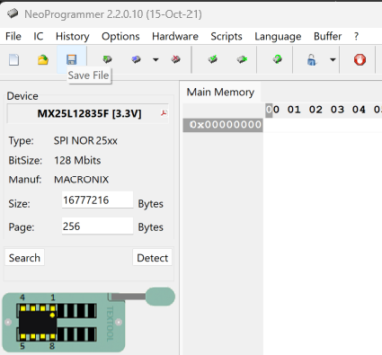

_**Save File** — writes the buffer out as `dump.bin`. Do this after each of the two reads._

### 4.3 — Copy both files into WSL

Open Windows Explorer and paste this path into the address bar. Then copy `dump.bin` and `dump2.bin` into that folder:

**Windows** — paste this path into the Explorer address bar
```bat
\\wsl$\Ubuntu\home\YOUR_WSL_USER\
```

### 4.4 — Check the read

**WSL** — Compare the two reads and check the size
```bash
cd ~
stat -c '%n %s' dump.bin dump2.bin
cmp dump.bin dump2.bin && echo "[OK] Both reads match"
```

> [!TIP]
> **You should see:**

**Output** — Expected output
```text
dump.bin 16777216
dump2.bin 16777216
[OK] Both reads match
```

> [!CAUTION]
> **If the size is not 16777216, or `cmp` says "differ", stop.** Push the clip on firmly, read again, and check again. Never carry on with a bad dump.

### 4.5 — Keep a copy inside WSL too

Step 7 writes into `dump.bin` directly, so keep an untouched copy next to it. `-n` makes sure it never overwrites an older backup.

**WSL** — Backup copy + remove the second read
```bash
cd ~
cp -n dump.bin dump_original.bin
rm -f dump2.bin
ls -la dump*.bin
```

## Step 5 — Unpack the RootFS

`WSL Ubuntu`

### 5.1 — Cut the JFFS2 part out of the dump

The filesystem starts 3,670,016 bytes into the chip and runs to the end. More about the layout in [Project Notes](#project-notes), note 1.

**WSL** — Go to WSL home folder
```bash
cd ~
```

**WSL** — Carve rootfs.jffs2 from dump.bin
```bash
dd if=./dump.bin of=./rootfs.jffs2 bs=128 skip=28672
```

### 5.2 — Unpack it with Jefferson

**WSL** — Enter jefferson folder
```bash
cd jefferson
```

**WSL** — Run Jefferson to extract JFFS2 into extractedRootFS
```bash
poetry run jefferson ../rootfs.jffs2 -d ../extractedRootFS -f
```

> [!CAUTION]
> **If Jefferson shows errors, the dump is corrupted.** Stop. Go back to [Step 4](#step-4--dump-the-firmware) and read the chip again.

## Step 6 — Edit VID/PID

`VS Code · WSL`

### 6.1 — Open the files in VS Code

**WSL** — Back to home and open VS Code in WSL mode
```bash
cd ..
code ./extractedRootFS
```

> [!NOTE]
> VS Code opens the unpacked files as a project. Edit the three files below. Use `Ctrl + F` to find the original values exactly.

> [!WARNING]
> **Got `Exec format error`?** This is a known WSL2 bug when **systemd** is turned on. The part that lets Linux run Windows `.exe` files stops working after startup. Run these four commands to fix it for good, then run `code ./extractedRootFS` again.

**WSL** — Permanently re-register WSL interop handler (fixes Exec format error)
```bash
sudo sh -c 'echo :WSLInterop:M::MZ::/init:PF > /usr/lib/binfmt.d/WSLInterop.conf'
sudo systemctl unmask systemd-binfmt.service
sudo systemctl restart systemd-binfmt
sudo systemctl mask systemd-binfmt.service
```

> [!WARNING]
> If it still acts up right after, restart WSL fully from PowerShell. Then open Ubuntu again and run `code ~/extractedRootFS`.

**Windows** — Fully restart WSL (PowerShell)
```bat
wsl --shutdown
```

### File 1 — etc/riddle.conf

The dongle's saved settings. This is the value the dongle actually uses.

**Find (original)**
```json
"USBVID": "1314",
"USBPID": "1521",
```

**Change to**
```json
"USBVID": "369D",
"USBPID": "38B",
```

### File 2 — etc/riddle_default.conf

The default settings. Without this change, a settings reset would bring back the old IDs.

**Find (original)**
```json
"USBVID": "1314",
"USBPID": "1521"
```

**Change to**
```json
"USBVID": "369D",
"USBPID": "38B"
```

### File 3 — script/start_accessory.sh

The backup values. They only run if the settings above are ever empty. Two lines:

**Find (original)**
```bash
echo 1314 > /sys/class/android_usb_accessory/android0/idVendor
```

**Change to**
```bash
echo 369D > /sys/class/android_usb_accessory/android0/idVendor
```

**Find (original)**
```bash
echo 1520 > /sys/class/android_usb_accessory/android0/idProduct
```

**Change to**
```bash
echo 38B > /sys/class/android_usb_accessory/android0/idProduct
```

> [!TIP]
> **Save all three files** (`Ctrl + S` in each tab) before you close VS Code.

### 6.2 — Check your edits

Don't trust your eyes alone. This shows every VID/PID line in the three files:

**WSL** — Show the VID/PID lines after editing
```bash
cd ~
grep -rn --include=riddle.conf --include=riddle_default.conf "USBVID\|USBPID" extractedRootFS
grep -rn --include=start_accessory.sh "android0/idVendor\|android0/idProduct" extractedRootFS
```

> [!TIP]
> **Every line must show your values:**

**Output** — Expected output (line numbers may differ)
```text
extractedRootFS/etc/riddle.conf:…:  "USBVID": "369D",
extractedRootFS/etc/riddle.conf:…:  "USBPID": "38B",
extractedRootFS/etc/riddle_default.conf:…:  "USBVID": "369D",
extractedRootFS/etc/riddle_default.conf:…:  "USBPID": "38B"
extractedRootFS/script/start_accessory.sh:…:  echo -n $idVendor > /sys/class/android_usb_accessory/android0/idVendor
extractedRootFS/script/start_accessory.sh:…:  echo 369D > /sys/class/android_usb_accessory/android0/idVendor
extractedRootFS/script/start_accessory.sh:…:  echo -n $idProduct > /sys/class/android_usb_accessory/android0/idProduct
extractedRootFS/script/start_accessory.sh:…:  echo 38B > /sys/class/android_usb_accessory/android0/idProduct
```

> [!TIP]
> The `echo -n $idVendor` / `$idProduct` lines are normal. They read the value from `riddle.conf`. If you still see `1314`, `1520` or `1521` anywhere, a file wasn't saved. Go back and fix it.

## Step 7 — Repack & Put Back

`WSL Ubuntu`

### 7.1 — Pack the edited files into a new JFFS2 image

**WSL** — Go to WSL home folder
```bash
cd ~
```

**WSL** — Repack extractedRootFS into new_rootfs.jffs2
```bash
mkfs.jffs2 --root=./extractedRootFS --output=./new_rootfs.jffs2 --eraseblock=64 --little-endian --pad=13107200
```

### 7.2 — Check it fits

**WSL** — Size of the new image
```bash
stat -c '%n %s' new_rootfs.jffs2
```

> [!CAUTION]
> **It must say exactly `new_rootfs.jffs2 13107200`.** If the number is bigger, the image won't fit on the chip. Stop, and don't do 7.3. Something other than the three files got added to `extractedRootFS`.

### 7.3 — Write it back into dump.bin

This puts the new image back in the same spot it came from. `conv=notrunc` keeps the rest of `dump.bin` as it is.

**WSL** — Inject new_rootfs.jffs2 back into dump.bin
```bash
dd if=./new_rootfs.jffs2 of=./dump.bin bs=128 seek=28672 conv=notrunc
```

**WSL** — Check the size and that only the filesystem part changed
```bash
stat -c '%n %s' dump.bin
cmp -n 3670016 dump.bin dump_original.bin && echo "[OK] First 3,670,016 bytes untouched"
```

> [!TIP]
> **You should see:**

**Output** — Expected output
```text
dump.bin 16777216
[OK] First 3,670,016 bytes untouched
```

> [!TIP]
> The size is still exactly 16 MB, and the bootloader and kernel at the start of the chip are exactly the same as before.

### 7.4 — Copy it back to Windows

Paste this path into the Explorer address bar, and copy `dump.bin` to a folder on Windows. Give the copy a clear name, like `dump_MOD.bin`, so you don't mix it up with your backup.

**Windows** — the finished file
```bat
\\wsl$\Ubuntu\home\YOUR_WSL_USER\dump.bin
```

## Step 8 — Flash With NeoProgrammer

`NeoProgrammer`

1. Check the clip is still on firmly, with the red wire on pin 1.
2. Open **NeoProgrammer**, click **Detect** and pick `MX25L12835F` again.
3. Open the changed file (`dump_MOD.bin`).
4. Click the **small arrow** next to the **Write IC** button.
5. Pick the full sequence below and let it run.
6. Wait for it to finish. There should be **no errors**.

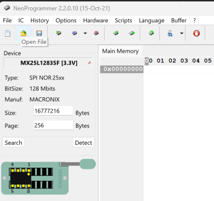

_**Open File** — load `dump_MOD.bin` into the buffer. Check the file name twice before you write anything._

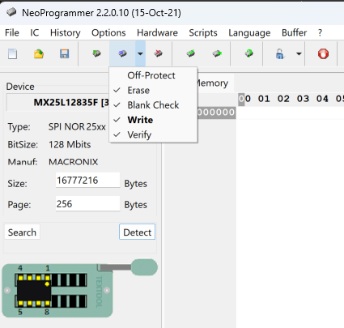

*The dropdown next to **Write IC**. Tick **Erase**, **Blank Check**, **Write** and **Verify** — that is the full sequence.*

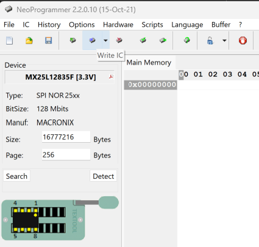

_**Write IC** runs the ticked steps in order. Don't touch the clip until Verify says it passed._

**NeoProgrammer** — Flash sequence — run in this exact order
```text
Erase → Blank Check → Write → Verify
```

> [!TIP]
> **Verify passed?** The chip now holds your changed firmware. Unplug the CH341A from the PC first, then take the clip off.

> [!WARNING]
> **If you get errors:** don't take the clip off. Close NeoProgrammer, push the clip on firmly, open it again and run the full sequence again. The chip is fine as long as you finish with a write that passes Verify. If nothing works, write your backup `dump.bin` back the same way.

## Step 9 — Test in the Car

`Done`

1. Close the dongle case.
2. Plug the dongle into the car's head unit.
3. Wait for it to boot (the LED settles).

> [!TIP]
> **That's it.** If Proton AutoKit opens by itself, the VID/PID are right.

> [!NOTE]
> **Want to go back?** Write your original backup `dump.bin` to the chip the same way as Step 8.

## Next Dongle

`WSL Ubuntu`

Doing another dongle? Jefferson is already set up, so **skip Steps 1–3**. Delete the old files, then start again from [Step 4](#step-4--dump-the-firmware).

> [!WARNING]
> **Before you delete anything,** make sure the last dongle's backup is saved on Windows. This removes its copies inside WSL.

**WSL** — Remove the last dongle's files
```bash
rm -f ~/dump.bin ~/dump2.bin ~/dump_original.bin ~/rootfs.jffs2 ~/new_rootfs.jffs2; rm -rf ~/extractedRootFS/
```

> [!NOTE]
> Then carry on with **Step 4 → 5 → 6 → 7 → 8 → 9** as normal. Every dongle gets its own read and its own backup. Never write one dongle's dump to another.

## Fix Fast

`Troubleshoot`

| Symptom | Cause | What to do |
|---|---|---|
| NeoProgrammer can't find the CH341A | The driver is missing, or the wrong one is installed | Install the **CH341PAR** driver (Step 1.3), not CH341SER. Unplug and replug the CH341A. |
| Detect finds no chip, or a random chip | The clip is loose, the wrong way round, or the dongle is getting power from somewhere else | Unplug the dongle from everything. Take the clip off, put it back on firmly with red on pin 1, then detect again. You can also pick `MX25L12835F` by hand. |
| `cmp` says the two reads differ | A bad contact during one of the reads | Push the clip on firmly and read twice more. Only carry on once two reads match. |
| `dump.bin` is not 16777216 bytes | Wrong chip picked, or the read stopped early | Check the chip is `MX25L12835F` and read again. |
| `pipx: command not found` or `poetry: command not found` | The PATH change from `pipx ensurepath` is not loaded yet | Run `source ~/.bashrc`, or close and reopen Ubuntu. |
| `ModuleNotFoundError: No module named 'cstruct'` (or `'click'`) | The CarlinKit version's extra packages are missing | `cd ~/jefferson && poetry add click cstruct`, then run Jefferson again. |
| Jefferson shows errors while unpacking | The dump is corrupted, or the normal Jefferson is still in place | Redo Step 3.2 to be sure the CarlinKit version is in place. If it still fails, read the chip again (Step 4). |
| `Exec format error` when running `code` | WSL2 + systemd bug | Run the four commands in Step 6.1. If needed, `wsl --shutdown` in PowerShell, then try again. |
| `code: command not found` | VS Code or its WSL extension is not installed | Do Step 1.5, then close and reopen Ubuntu. |
| Step 6.2 still shows `1314`, `1520` or `1521` | A file was not saved | Open that file in VS Code, fix the value, press `Ctrl + S`, and run 6.2 again. |
| `mkfs.jffs2: command not found` | `mtd-utils` is not installed | `sudo apt install -y mtd-utils` |
| `new_rootfs.jffs2` is bigger than 13107200 | Extra files ended up in `extractedRootFS` | Don't write it back. Delete `extractedRootFS`, redo Step 5 and Step 6, and only change the three files. |
| Windows Explorer can't find `\\wsl$` | WSL is not running | Open Ubuntu first and keep the window open, then try the path again. Or use `\\wsl.localhost\Ubuntu\home\…`. |
| Verify fails in NeoProgrammer | Bad contact during the write | Don't take the clip off. Push it on firmly and run the full sequence again. |
| Flashed, but the head unit still doesn't detect it | The VID/PID don't match what the head unit looks for | Pull `res/xml/device_filter.xml` out of your head unit's AutoKit APK and check the real numbers. They are **decimal** in that file, so convert them to hex. |
| Dongle doesn't boot after flashing | A bad write, or a bad dump was used | Write your original backup `dump.bin` back with the full sequence in Step 8. |

## Project Notes

`Findings & Evidence`

This is not a step. These notes explain why the guide does things the way it does.

### 1 — Flash layout

The `dd` numbers in Step 5 and Step 7 come from where the JFFS2 filesystem sits on the 16 MB chip:

| Part | Start | Size |
|---|---|---|
| Bootloader, kernel, etc. | 0 (0x000000) | 3,670,016 bytes (0x380000) |
| JFFS2 rootfs | 3,670,016 (0x380000) | 13,107,200 bytes (0xC80000) |
| **Total** |  | **16,777,216 bytes (16 MB)** |

- `bs=128 skip=28672` / `seek=28672`: 128 × 28,672 = 3,670,016. That is the start of the rootfs.
- `--pad=13107200`: makes the new image exactly the size of the rootfs part, so it fills the space to the end of the chip. That is why Step 7.2 checks the size.
- `--eraseblock=64`: 64 KiB, the erase block size of the MX25L12835F.
- `--little-endian`: the original image is little-endian, so the new one must be too.

### 2 — Why plain hex, not 0x

- The stock firmware never puts `0x` in front of any sysfs value. In the 2024.01, 2025.02 and 2025.10 versions, every value is plain hex: `1314`, `1520`, `12d1`, `0001`, `04e8`, `6860`, `18d1`, `2d00`, `1d6b`, `a4a5`, `08e4`, `01c0`.
- CarlinKit's real vendor ID *is* `0x1314`, but the script writes `1314`. That shows the value is read as hex without the prefix.
- The stock `android_usb` driver saves the value with `sscanf(buff, "%04x", &value)`. It only reads 4 characters. Give it `0x369D` and it reads just `0x36`, the wrong ID. Give it `369D` and you get **0x369D**, which is right.

> [!NOTE]
> Older versions of this guide showed `0x` in File 3. That was wrong, and it has been fixed.

### 3 — Which file actually takes effect

In `start_accessory.sh`, the value comes from the saved settings first. The line you edit in File 3 is only a backup:

**Reference** — start_accessory.sh — which part actually runs
```text
idVendor=`riddleBoxCfg -g USBVID`     # reads etc/riddle.conf
...
if [ -n "$idVendor" ]; then
    echo -n $idVendor > .../idVendor   <-- this runs (value from riddle.conf)
else
    echo 369D > .../idVendor           <-- File 3 edit; only if the settings are empty
fi
```

So **File 1 is the one that really counts**. File 2 keeps the new IDs after a settings reset. File 3 is a backup in case the settings are ever wiped. We checked this on a real modded dongle that works: its `riddle.conf` had `369D`/`38B` in plain hex, and that is the value the kernel got.

### 4 — Where 369D / 38B come from

The Proton head unit's AutoKit APK has `res/xml/device_filter.xml`:

**Reference** — device_filter.xml (decoded from binary XML)
```text
<resources>
  <usb-device product-id="907" vendor-id="13981"/>
  <usb-device class="239" subclass="2"/>
</resources>
```

| Field | Decimal (in the XML) | Hex (for firmware) |
|---|---|---|
| vendor-id | 13981 | **369D** |
| product-id | 907 | **38B** |

The head unit only opens AutoKit when a USB device with that VID/PID is plugged in. For a different head unit, pull the same file out of its APK and convert the numbers to hex.

### 5 — Why the CarlinKit version of Jefferson

The normal Jefferson doesn't unpack CarlinKit's JFFS2 image properly. [ludwig-v/jefferson_carlinkit](https://github.com/ludwig-v/jefferson_carlinkit) handles it. The guide installs the normal Jefferson first so that poetry sets up the project, then swaps in the CarlinKit code. The CarlinKit code needs `click` and `cstruct`, which the original project doesn't list, so Step 3.3 adds them.

### 6 — References

- [ludwig-v / wireless-carplay-dongle-reverse-engineering](https://github.com/ludwig-v/wireless-carplay-dongle-reverse-engineering) — research on CarlinKit dongles
- [ludwig-v / jefferson_carlinkit](https://github.com/ludwig-v/jefferson_carlinkit) — the CarlinKit JFFS2 extractor
- [onekey-sec / jefferson](https://github.com/onekey-sec/jefferson) — the original Jefferson project
